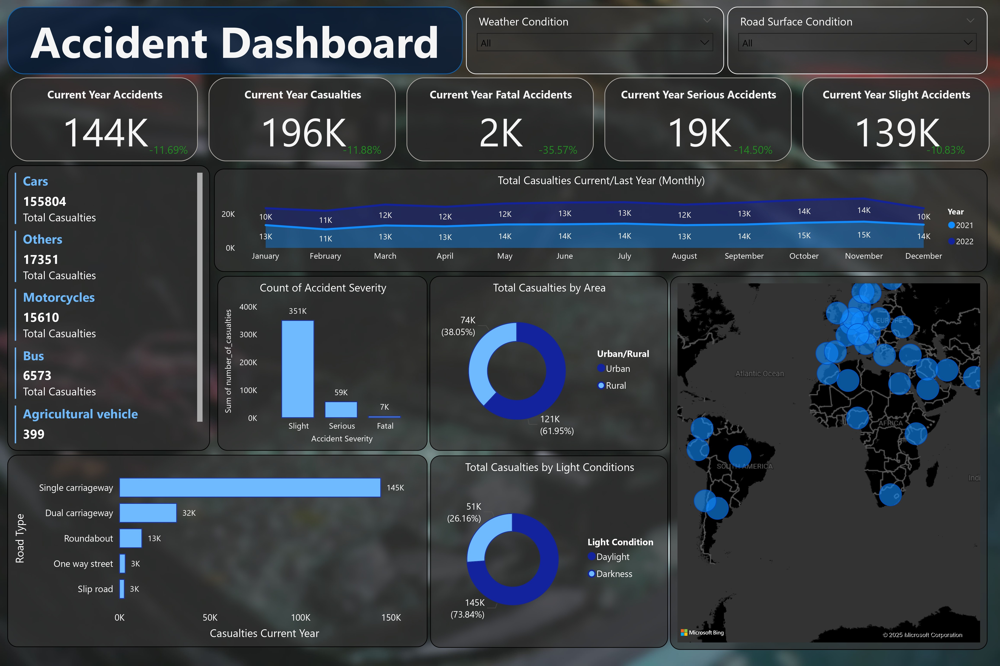
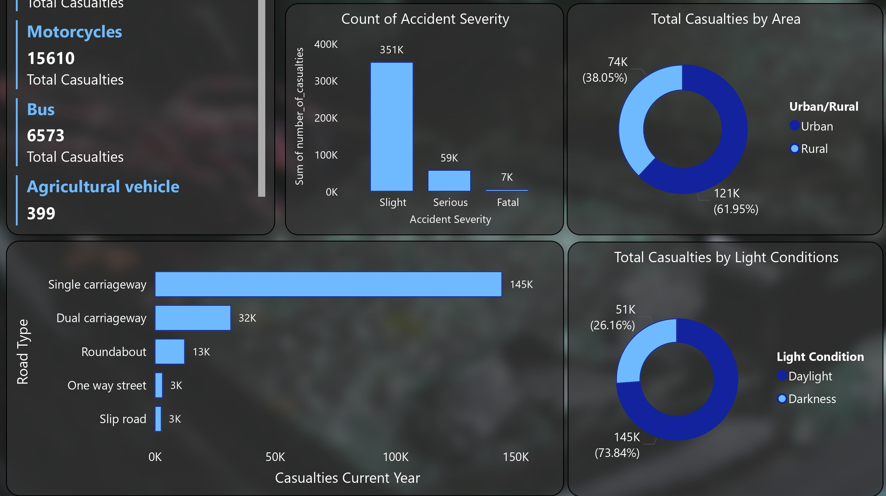
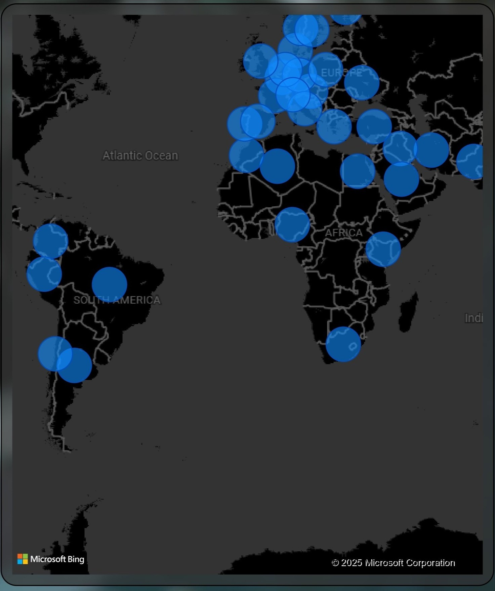

# لوحة بيانات الحوادث – Power BI Dashboard

مشروع تفاعلي تم تصميمه باستخدام **Power BI** لعرض وتحليل بيانات الحوادث بطريقة احترافية ومنظمة.

## مميزات المشروع:
- تحليل بيانات الحوادث حسب شدة الحوادث، المركبات، أسباب الحوادث والعوامل المؤثرة.  
- عرض المرونة في الأشكال البيانية بحيث تتغير بشكل ديناميكي لتوضيح الأنماط المختلفة للبيانات.  
- جداول تفصيلية تعرض كل المعلومات المهمة بطريقة منظمة وسهلة الفهم.  
- تقسيم اللوحة إلى أقسام رئيسية لتسهيل المتابعة والتحليل:
  - **ملخص عام** لعرض أهم المؤشرات.
  - **نظرة عامة** لتوضيح التوزيعات والأنماط.
  - **تفاصيل دقيقة** لكل الحوادث والبيانات المرتبطة بها.

## لقطات من المشروع

## الملفات المرفقة
- [AccidentDashboard.pbix](./AccidentDashboard.pbix) ← ملف Power BI الأصلي.
- [AccidentDashboard.pdf](./AccidentDashboard.pdf) ← نسخة PDF للمعاينة.

> كل شيء تم إنشاؤه باستخدام **Power BI** لضمان تحليلات دقيقة ومرنة.
