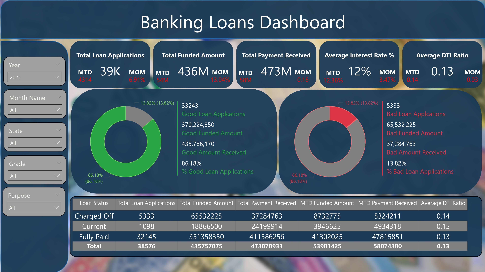
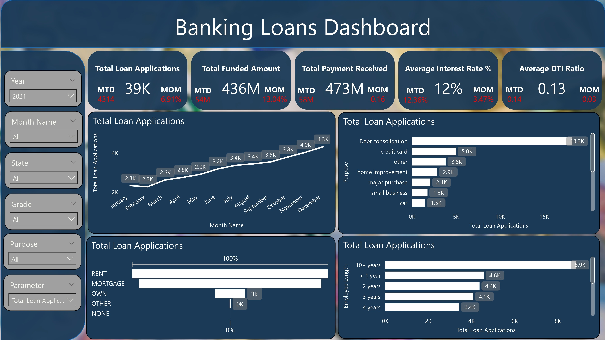
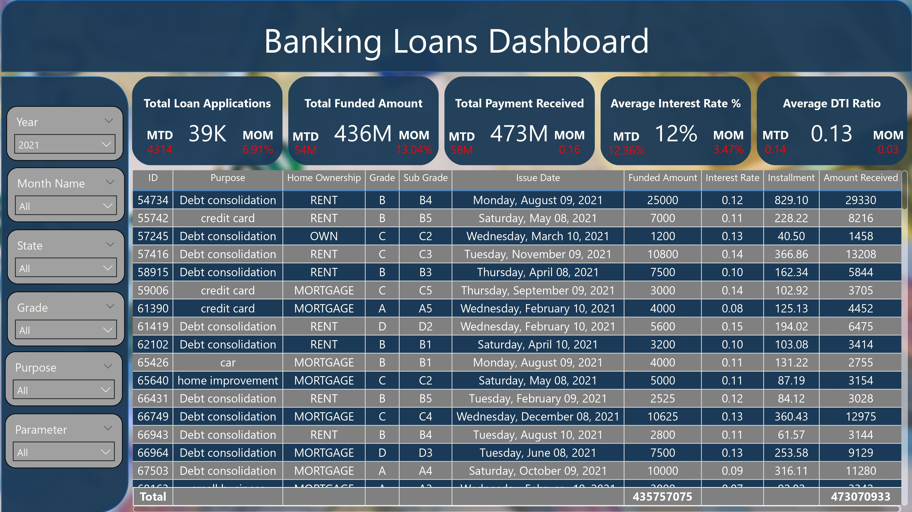

\# لوحة بيانات القروض البنكية – Power BI Dashboard

مشروع تفاعلي تم تصميمه باستخدام \*\*Power BI\*\* لعرض وتحليل بيانات القروض البنكية بطريقة احترافية ومنظمة.

\## مميزات المشروع:

\- تحليل بيانات القروض مع إمكانية استعراضها حسب السنة، الشهر، الولاية، نوع القرض، والهدف منه.

\- عرض المرونة في الأشكال البيانية بحيث تتغير بشكل ديناميكي لتوضيح الأنماط المختلفة للبيانات.

\- جداول تفصيلية تعرض كل المعلومات المهمة بطريقة منظمة وسهلة الفهم.

\- تقسيم اللوحة إلى أقسام رئيسية لتسهيل المتابعة والتحليل:

&nbsp; - \*\*ملخص عام\*\* لعرض أهم المؤشرات.

&nbsp; - \*\*نظرة عامة\*\* لتوضيح التوزيعات والأنماط.

&nbsp; - \*\*تفاصيل دقيقة\*\* لكل القروض والبيانات المرتبطة بها.

\## لقطات من المشروع:

\## الملفات المرفقة:

\- `Financial\_Loans.pbix` ← ملف Power BI الأصلي.

\- `Financial\_Loans.pdf` ← نسخة PDF للمعاينة.

> كل شيء تم إنشاؤه باستخدام \*\*Power BI\*\* لضمان تحليلات دقيقة ومرنة.

